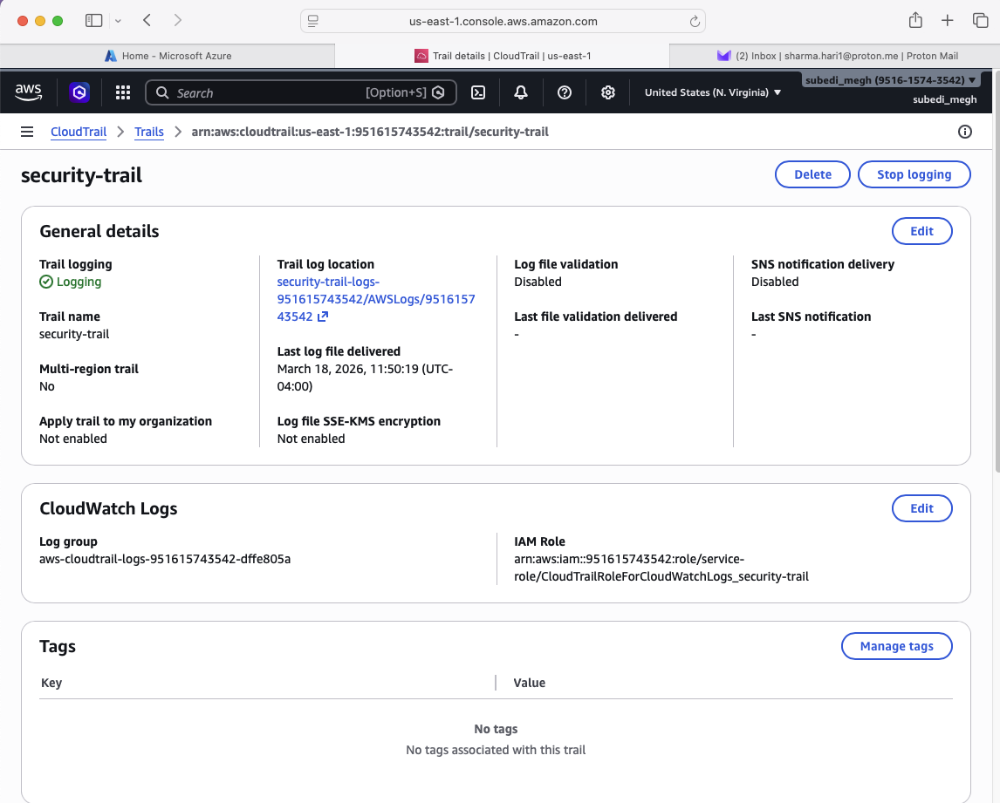
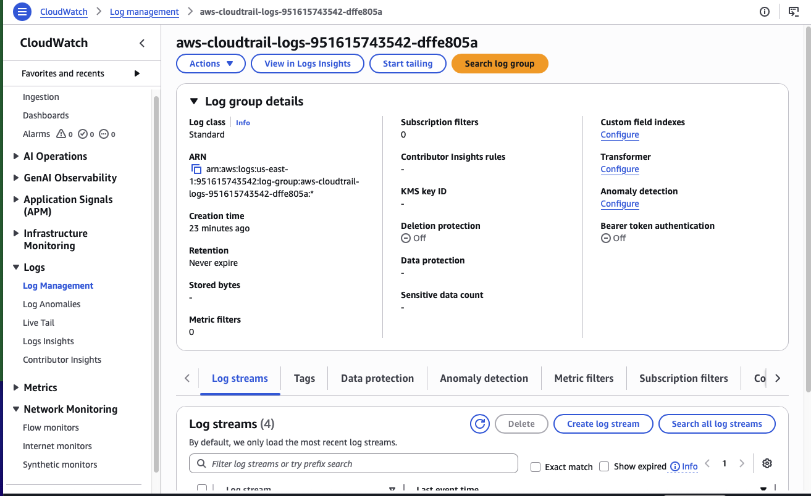
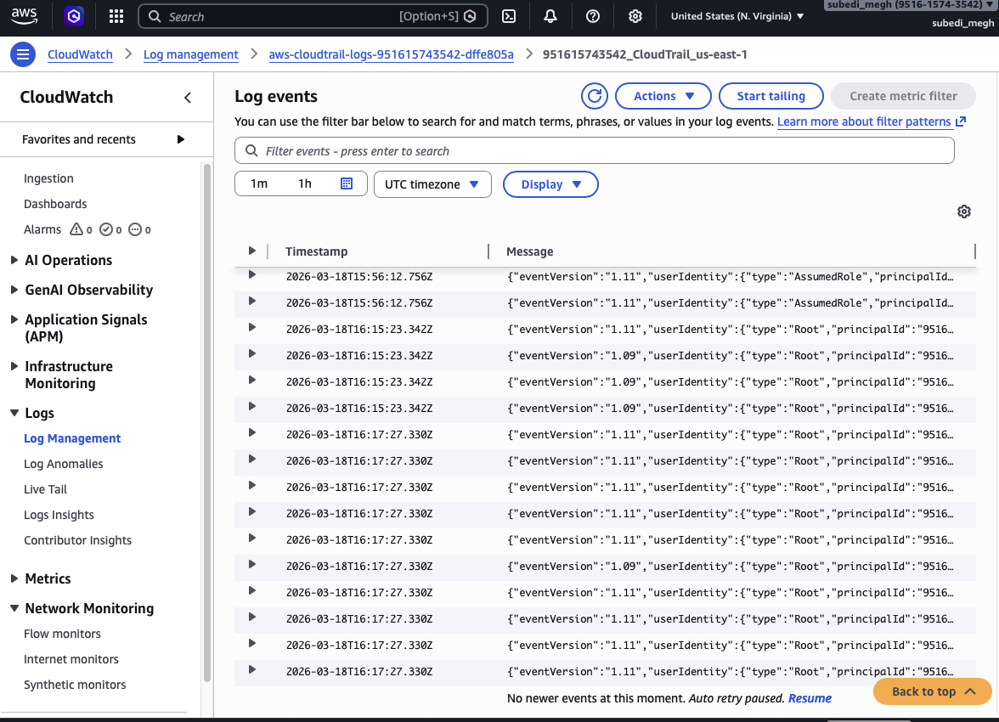
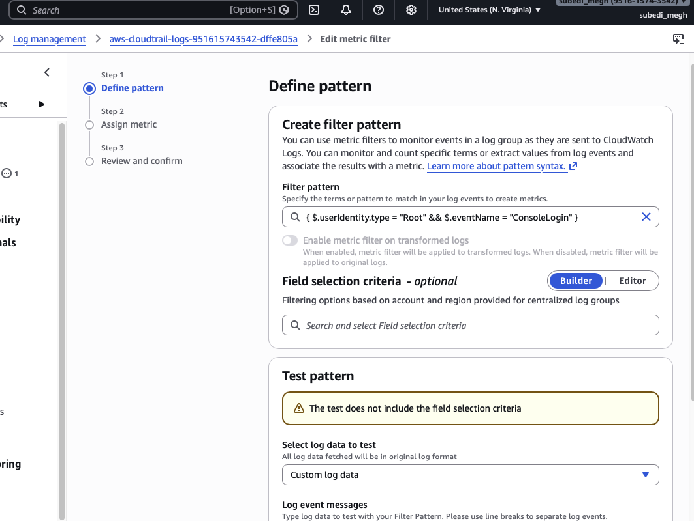
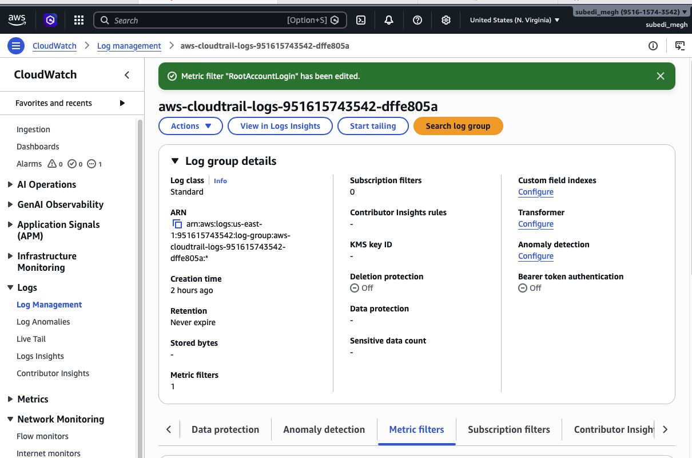
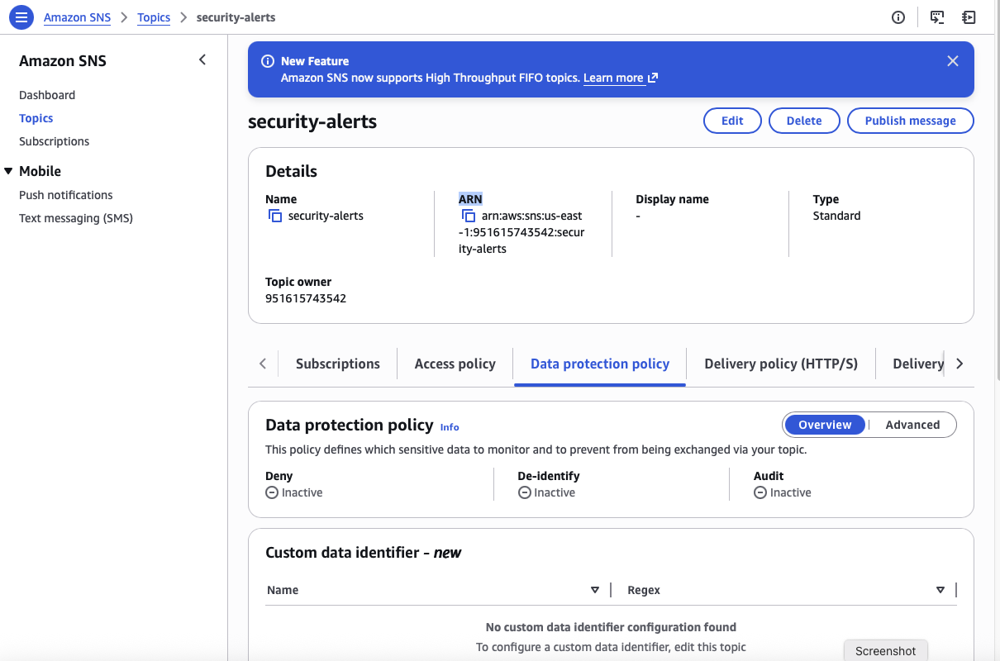
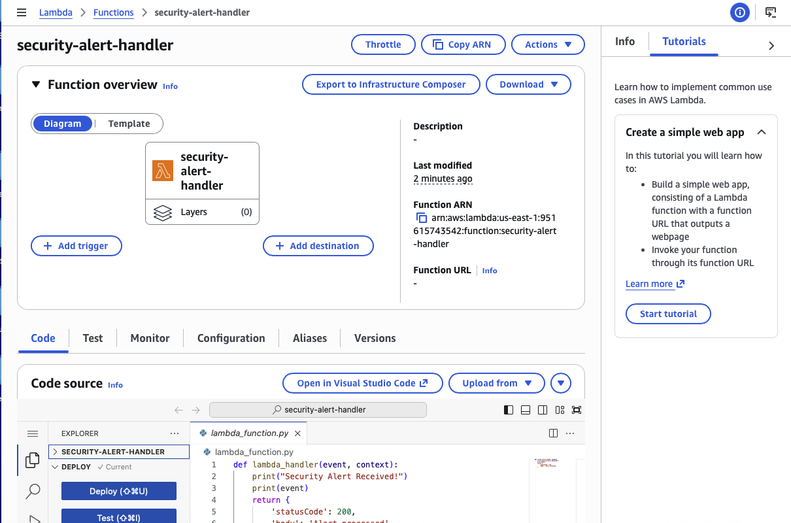
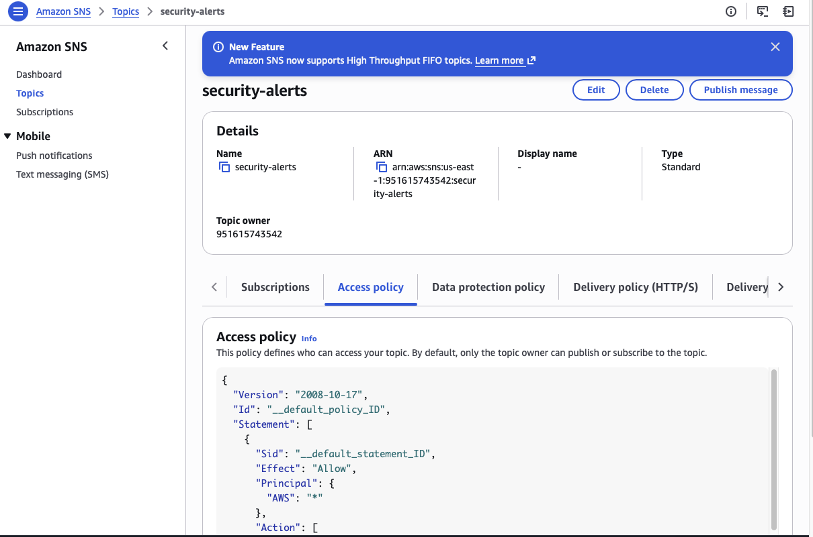

# Multi-Cloud Security Automation CI/CD Pipeline

This project demonstrates a GitHub Actions CI/CD pipeline that:

- Authenticates securely to AWS and Azure
- Uses GitHub Secrets for credential management
- Executes cloud validation commands automatically
- Verifies infrastructure without manual intervention

---

## Architecture

### AWS Security Monitoring and Automation Pipeline

    AWS Activity
         |
         v
    CloudTrail
         |
         v
    S3 Log Storage
         |
         v
    CloudWatch Logs
         |
         v
    Metric Filter (Root Login Detection)
         |
         v
    CloudWatch Alarm
         |
         v
    SNS Topic
       / \
      v   v
   Email  Lambda
   Alert  Automation

Purpose: Detect privileged activity and trigger automated security workflows.

---

## AWS Components Implemented

### Logging
- AWS CloudTrail – records API activity
- Amazon S3 – stores CloudTrail logs

### Monitoring
- CloudWatch Logs – centralized log monitoring
- CloudWatch Metric Filters – detection rules for security events

### Alerting
- CloudWatch Alarm – triggers alerts when detection conditions occur
- Amazon SNS – notification system

### Automation
- AWS Lambda – event-driven automation triggered by alerts

---

## Security Detection Implemented

### Root Account Login Detection

`{ $.userIdentity.type = "Root" && $.eventName = "ConsoleLogin" }`

Purpose: Root account usage is considered **high-risk activity**.  
This rule detects when the AWS root user logs into the console.

---

## Infrastructure Created

### CloudTrail
`security-trail`

### S3 Log Storage
`security-trail-logs-951615743542`

### CloudWatch
- Log group for CloudTrail logs
- Metric filter for root login detection

Alarm:

`RootAccountLoginAlarm`

### SNS
Topic:

`security-alerts`

Subscriptions:
- Email notification
- Lambda automation

### Lambda
Function:

`security-alert-handler`

---

## Event-Driven Automation

    CloudWatch Alarm
           |
           v
       SNS Topic
           |
           v
     Lambda Function

Lambda receives alert events and can perform automated actions such as:
- sending security alerts
- creating incident tickets
- disabling compromised credentials
- forwarding alerts to SIEM or SOAR platforms

---

## Skills Demonstrated

- Cloud security monitoring
- Detection engineering
- AWS logging architecture
- Event-driven automation
- Serverless security workflows
- AWS CLI-based infrastructure management

---

## Current Status

    AWS Logging Architecture        Complete
    AWS Detection Pipeline          Complete
    AWS Alerting Pipeline           Complete
    AWS Automation (Lambda)         Complete

Planned next stages:

    Azure Security Monitoring       Planned
    Policy-as-Code                  Planned
    CI/CD Security Automation       Planned
    Terraform Infrastructure        Planned

---

## Next Steps

### CI/CD Security Automation

    GitHub
       |
       v
    GitHub Actions
       |
       v
    Terraform
       |
       v
    AWS / Azure Infrastructure

### Azure Security Monitoring

    Azure Activity Logs
            |
            v
        Log Analytics
            |
            v
        Detection Rules (KQL)
            |
            v
        Azure Monitor Alerts
            |
            v
        Action Groups
            |
            v
        Azure Functions

---

## Notes for Future Work

When resuming development:

1. Build Terraform modules for AWS infrastructure
2. Implement GitHub Actions CI/CD pipeline
3. Create Azure monitoring pipeline
4. Add EventBridge automation rules
5. Expand Lambda remediation logic

---

## Repository Structure (Planned)

The following structure will support the future work listed above.

multicloud-security-automation
│
├── README.md
│
├── aws
│   ├── cloudtrail
│   ├── cloudwatch
│   ├── sns
│   └── lambda
│
├── azure
│
├── terraform
│
└── .github
    └── workflows

This structure will support:

- AWS security monitoring infrastructure
- Azure monitoring components
- Terraform infrastructure as code
- GitHub Actions CI/CD automation

---

## Screenshots

### CloudTrail Trail Configuration

### CloudTrail Log Stream

### CloudTrail Event Example

### CloudWatch Metric Filter

### CloudWatch Alarm / Detection

### SNS Topic Configuration

### Lambda Function

### Lambda Trigger from SNS

# trigger pipeline
# trigger pipeline
